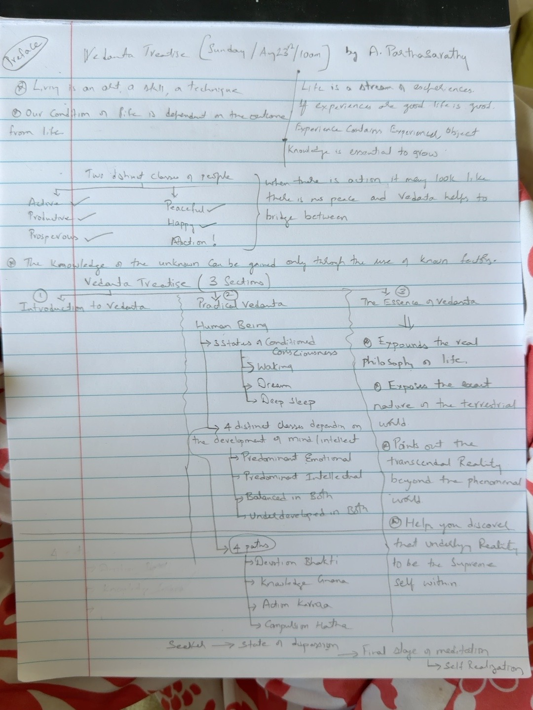

# Preface

**Study date:** Sunday, August 23, 2026  
**Primary study source:** *Vedanta Treatise* by A. Parthasarathy  
**Learning context:** Personal handwritten notes from Vedanta study

---

## Living Is an Art, Skill, and Technique

<div class="handwritten-note" markdown="1">

**Living is an art, a skill, a technique.**

</div>

<div class="ai-note" markdown="1">

We normally assume that because we are alive, we automatically know how to live. Vedanta challenges that assumption.

A person may know how to earn, manage projects, solve technical problems, build relationships, or acquire possessions and yet struggle to handle disappointment, criticism, uncertainty, desire, success, failure, or change.

**Knowing how to operate in the world is not necessarily the same as knowing how to live in the world.**

Living is an **art** because human situations require sensitivity and balance. It is a **skill** because our ability to meet life's situations can improve through understanding and practice. It is a **technique** because certain principles can be learned and repeatedly applied to our inner personality.

</div>

---

## Life Is a Stream of Experiences

<div class="handwritten-note" markdown="1">

**Life is a stream of experiences.**

If experiences are good, life appears good. An experience contains the **experiencer**, the **experienced object or situation**, and the relationship between them.

</div>

<div class="ai-note" markdown="1">

We never encounter “life” as one single event. Life reaches us continuously through experiences: conversations, work, family, success, delay, praise, criticism, pleasure, fear, memory, gain and loss.

Ordinarily we try to improve life primarily by improving the **experienced object** — a better job, better circumstances, better possessions, better recognition or more favorable outcomes.

Vedanta introduces another possibility: examine the **experiencer** as well. Two people can meet the same external event and experience it very differently because their minds, expectations, attachments and understanding differ.

Therefore, improving the quality of life involves not only arranging circumstances but also educating the personality that meets those circumstances.

</div>

---

## Dependence on Life's Outcomes

<div class="handwritten-note" markdown="1">

Our condition in life often becomes dependent on the outcome we receive from life.

</div>

<div class="ai-note" markdown="1">

When circumstances match our desires, we tend to call ourselves happy. When they oppose our desires, we become disturbed. In this way we gradually hand control of our inner condition to external outcomes.

Vedanta does not suggest that outcomes are irrelevant. We still plan, work, care and pursue appropriate goals. The deeper issue is **psychological dependence**: must an external result determine whether I can remain internally balanced?

This distinction becomes central to learning how to participate fully in life without being completely controlled by life's fluctuations.

</div>

---

## Action, Productivity, and Peace

<div class="handwritten-note" markdown="1">

Two broad tendencies were contrasted:

**Active / Productive / Prosperous**  
**Peaceful / Happy**

Vedanta helps bridge the two.

</div>

<div class="ai-note" markdown="1">

Modern life can make it appear that achievement and peace are opposites. One person may be ambitious, productive and successful but mentally agitated. Another may seek peace by reducing activity, responsibility or ambition.

Vedanta proposes a different ideal: **dynamic action with inner composure.**

Action and agitation are not identical. A person may work intensely while remaining mentally composed; another may sit quietly while the mind races with worry.

For example, while preparing an important presentation, one person may spend much of the available mental energy worrying about recognition, failure and other people's reactions. Another can prepare just as intensely while keeping attention on what can actually be done now — preparation, accuracy, rehearsal and clarity.

The second person has not become less active. The unnecessary inner friction has been reduced.

</div>

---

## Knowledge: From the Known to the Unknown

<div class="handwritten-note" markdown="1">

**Knowledge of the unknown can be gained through the use of known factors.**

Knowledge is essential to grow.

</div>

<div class="ai-note" markdown="1">

New understanding needs a point of reference. We learn multiplication after addition and abstract concepts through examples already familiar to us.

Vedanta similarly begins with what we can observe directly — body, thoughts, emotions, desires, waking experience, dreams, deep sleep and the changing world — and uses these known experiences to investigate subtler questions about consciousness, Reality and the Self.

Rather than accepting large philosophical words as beliefs, the student is encouraged to inquire carefully from experience.

</div>

---

## Practical Vedanta: Understanding the Human Personality

<div class="handwritten-note" markdown="1">

Practical Vedanta examines the **human being** and the personality through which life is experienced.

Three states of conditioned consciousness are introduced:

**Waking → Dream → Deep Sleep**

The notes also distinguish **mind** and **intellect** and classify broad personality tendencies according to their relative development.

</div>

<div class="ai-note" markdown="1">

Before investigating the universe, Vedanta asks us to understand the instrument through which we experience it: the human personality.

The **mind** may be understood here as the seat of feelings, desires, impulses, likes, dislikes and emotional reactions. The **intellect** represents discrimination, judgment, reasoning and direction.

The objective is not to eliminate emotion or become purely intellectual. A balanced personality combines emotional energy with intellectual direction.

The waking, dream and deep-sleep states then become important fields of inquiry. Comparing these states eventually raises deeper questions about what changes and what, if anything, remains fundamental to the experiencer.

</div>

---

## Four Paths of Development

<div class="handwritten-note" markdown="1">

**Bhakti — Devotion**  
**Jnana — Knowledge**  
**Karma — Action**  
**Hatha / Compulsion — mastery of the personality**

</div>

<div class="ai-note" markdown="1">

Different personalities may require different emphases in development.

**Bhakti** works particularly with emotional energy, directing devotion toward a higher ideal. **Jnana** emphasizes inquiry, discrimination and understanding through the intellect. **Karma** develops the personality through purposeful action and a healthier relationship with results.

In the terminology captured in these notes, **Hatha / Compulsion** refers to gaining such disciplined command over the personality that the body, mind and intellect can be consciously directed.

**Ordinary compulsion:** My personality controls me.  
**Compulsion in this teaching:** I develop sufficient mastery to direct my personality consciously.

</div>

---

## The Seeker's Journey to Self-Realization

<div class="handwritten-note" markdown="1">

**Seeker → Dispassionate State → Meditation State → Self-Realized State**

</div>

<div class="ai-note" markdown="1">

The **seeker** begins questioning ordinary assumptions about happiness, identity and the purpose of life.

The **dispassionate state** does not mean becoming emotionless, uncaring or inactive. It means gradually reducing psychological dependence on objects, people, circumstances and outcomes for one's inner completeness.

As the outward pull of desires and dependencies reduces, the mind becomes increasingly capable of sustained contemplation. This leads toward the **meditation state**.

The culmination is the **Self-Realized state** — realization of one's essential nature beyond exclusive identification with changing body, mind, roles, circumstances and experiences.

```text
SEEKER
  ↓
DISPASSIONATE STATE
  ↓
MEDITATION STATE
  ↓
SELF-REALIZED STATE
```

</div>

---

## The Essence of Vedanta

<div class="handwritten-note" markdown="1">

1. Understand the real philosophy of life.
2. Examine the nature of the terrestrial or phenomenal world.
3. Inquire into the transcendental Reality beyond changing phenomena.
4. Discover that underlying Reality as the Supreme Self within.

</div>

<div class="ai-note" markdown="1">

The practical study begins by improving how we meet life. The deeper study eventually asks a more fundamental question: **What is the nature of the person who is experiencing life?**

The phenomenal world is characterized by change: body, possessions, relationships, professional roles, pleasure, pain and thoughts all change. Vedanta asks us to understand this accurately rather than demand permanent psychological security from inherently changing conditions.

The inquiry then turns toward whether there is a more fundamental Reality underlying changing experience and, ultimately, toward the Vedantic investigation of the **Self**.

</div>

---

## AI Summary of the Preface

The Preface provides a map for the journey that follows. It begins with the immediate problem of **living well**. Life is experienced as a continuous stream of encounters between the experiencer and the world, and our inner condition often rises and falls with external outcomes.

Vedanta proposes that a person need not choose between worldly effectiveness and inner peace. Its practical objective is to develop a personality capable of **dynamic action without unnecessary mental agitation**.

This requires understanding the human instrument — body, mind and intellect — and examining our waking, dream and deep-sleep experiences. Different aspects of the personality may be developed through devotion, knowledge, action and disciplined mastery.

As the seeker grows in understanding, psychological dependence on external objects and outcomes gradually decreases. This is **dispassion**, not indifference. A more composed and prepared mind becomes capable of deeper meditation and Self-inquiry.

The journey ultimately moves from learning **how to live** toward investigating **who is the one living**.

> **Vedanta seeks to transform the experiencer so that one can live dynamically in the world, remain inwardly composed, and ultimately inquire into the true nature of the Self.**

---

## Original Handwritten Notes

The original handwritten page is preserved here as the primary record of this study session. The image can be replaced later with a clearer photograph or scan without changing the chapter.

[](../assets/handwritten-notes/preface-2026-08-23-page-01.jpg)

*Click the image to open the full-size version.*

---

## Check Your Understanding

These questions are study aids generated from the topics covered in this Preface.

??? question "1. Why does Vedanta describe living as an art, skill, and technique?"
    Because merely being alive does not ensure that we know how to handle life's experiences. Living requires sensitivity and balance like an art, improves through practice like a skill, and can be guided by learnable principles like a technique.

??? question "2. If life is a stream of experiences, what are the main components of an experience?"
    The notes identify the **experiencer**, the **experienced object or situation**, and the relationship or contact between them.

??? question "3. Does Vedanta ask a person to choose peace instead of productivity?"
    No. Vedanta seeks **dynamic action with inner composure** — remaining active, responsible and productive while reducing unnecessary psychological agitation and dependence on results.

??? question "4. What does dispassion mean in the Seeker → Self-Realization journey?"
    Dispassion means reducing psychological dependence on changing objects, people, circumstances and outcomes for one's inner completeness. It does not mean indifference or lack of emotion.

??? question "5. What is meant by Hatha / Compulsion in these handwritten notes?"
    In this teaching, **compulsion** refers to disciplined mastery of the personality — developing sufficient command to consciously direct the body, mind and intellect.
